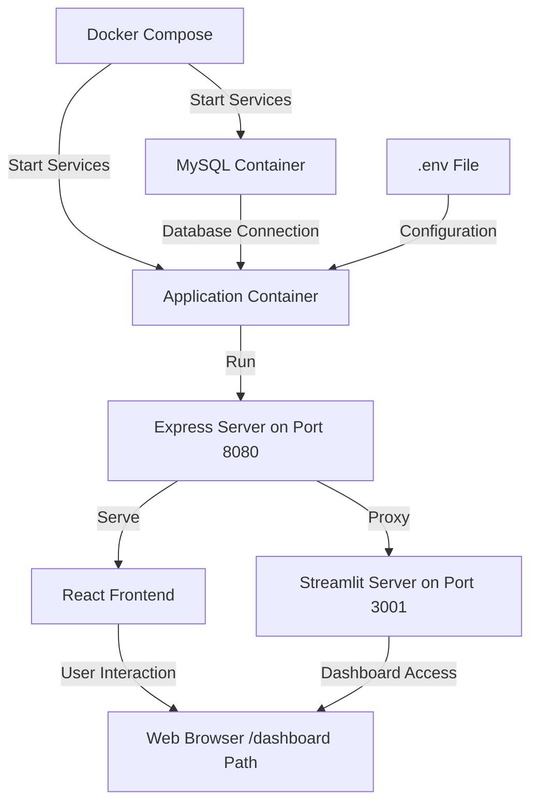

# 🌐 Fund of Funds Analysis Platform

## 📊 Overview
An interactive platform for analyzing Fund of Funds (FOF) structures, with a focus on mutual funds like MFS Diversified International Fund (MDIZX) and others such as GLEAX, LIONX, and more. The platform provides real-time visualization of fund structures, holdings analysis, overlap detection, and an AI-powered chat interface for fund data exploration, all accessible through a modern React frontend with a Streamlit dashboard integration.

## ✨ Key Features
- 🔍 **Fund Structure Visualization**
  - Interactive Sankey diagram showing fund relationships
  - Two-level holdings breakdown
  - Holdings overlap detection across funds

- 📈 **Portfolio Analysis**
  - Asset allocation by category
  - Top holdings identification
  - Cross-fund exposure tracking

- 🎯 **Data Integration**
  - SEC EDGAR NPORT-P filings
  - Real-time data processing
  - Automated holdings updates

- 🤖 **AI-Powered Chat Interface**
  - Gemini 2.0 Flash API integration
  - Context-aware fund data retrieval
  - Ticker symbol detection and validation (@ticker)
  - Overlap analysis integration (@overlap)
  - Enhanced responses with real-time fund data
  - Seamless dashboard-to-chat interaction

## 🚀 Current Analysis: MDIZX
- Total Assets: $38.06B
- Direct Holdings: 7 funds
  - MRSKX: $10.48B (27.5%) - 110 holdings
  - MEMJX: $6.54B (17.2%) - 101 holdings
  - MKVHX: $5.73B (15.0%) - 91 holdings
  - MINJX: $5.72B (15.0%) - 91 holdings
  - MGRDX: $5.70B (15.0%) - 88 holdings
  - MIDLX: $3.82B (10.0%) - 345 holdings

## 🏗️ Project Structure
```
FOFs-Capstone/
├── frontend/                # React frontend
│   ├── src/
│   │   ├── components/      # UI components
│   │   ├── pages/           # Page layouts
│   │   └── App.tsx          # Main application
├── src/
│   ├── dashboard/           # Streamlit dashboard
│   │   ├── app.py           # Main dashboard app
│   │   └── components/      # Dashboard components
│   │       ├── fund_structure.py
│   │       └── portfolio_analysis.py
│   ├── database/            # Database layer
│   │   └── manager.py       # Connection management
│   ├── models/              # Data models
│   │   └── models.py        # SQLAlchemy models
│   ├── collectors/          # Data collectors
│   │   └── edgar_collector.py # SEC EDGAR API client
│   ├── scripts/             # Utility scripts
│   │   └── load_initial_funds.py # Data loading
│   └── services/            # Business logic
│       ├── fund_service.py  # Fund data operations
│       └── gemini_service.py # AI integration
├── server.js                # Express server
├── docker-compose.yml       # Multi-container setup
├── Dockerfile               # Container definition
├── requirements.txt         # Python dependencies
└── .env.example            # Environment template
```

## 🛠️ Tech Stack
- 🐍 Python 3.11
- 🎈 Streamlit
- 🐬 MySQL 8.0
- 🐋 Docker
- 📊 Plotly
- 🧠 Google Gemini 2.0 Flash API
- ⚛️ React/TypeScript
- 🚂 Express.js
- 🌐 Nginx
- 🔄 React Query
- 💅 Tailwind CSS
- 🍞 Sonner (Toast notifications)

## 📦 Prerequisites
- Docker and Docker Compose
- MySQL 8.0+
- SEC EDGAR API access
- OpenFIGI API key
- Google Gemini API key

## 🚀 Quick Start

1. **Clone the repository:**
```bash
git clone https://github.com/yourusername/FOFs-Capstone.git
cd FOFs-Capstone
```

2. **Set up environment:**
```bash
cp .env.example .env
# Edit .env with your credentials
```

3. **Start with Docker:**
```bash
docker-compose up -d
```

4. **Access the dashboard:**
```
http://localhost:8501
```

## 📊 Dashboard Features

### 1. Fund Overview
- Summary metrics
- Asset allocation visualization
- Direct holdings breakdown

### 2. Fund Structure
- Interactive Sankey diagram
- Two-level holdings display
- Overlap visualization

### 3. Securities Analysis
- Top holdings by value
- Category breakdown
- Detailed holdings tables

### 4. Search Functionality
- Ticker search
- CUSIP lookup

### 5. AI-Powered Chat Interface
- Natural language queries about funds
- Automatic ticker detection and data retrieval
- Support for @mentions to explicitly reference tickers
- Real-time fund data integration for accurate responses
- Multi-turn conversation context management
- **Overlap Analysis Integration:**
  - Use `@overlap` keyword in chat to analyze fund overlaps
  - Automatically retrieves current overlap analysis data from dashboard
  - "Ask BiL about this analysis" button for one-click overlap insights
  - Combines overlap data with fund information for comprehensive analysis

## 🔄 Detailed Workflows

### 1. Data Collection & Processing Workflow


1. **Initial Data Collection**:
   - EdgarCollector connects to SEC EDGAR database
   - Retrieves NPORT-P filings for specified funds
   - Parses XML/JSON responses for holdings data

2. **Data Processing**:
   - DataLoader orchestrates the ETL process
   - Validates and cleans raw SEC data
   - Resolves security identifiers via OpenFIGI API
   - Transforms into structured format for database storage

3. **Database Storage**:
   - DatabaseManager handles connection pooling and transactions
   - Stores fund, holding, and filing data in normalized tables
   - Maintains relationships between entities

### 2. Fund Analysis Workflow


1. **Fund Selection**:
   - User selects fund ticker from dashboard interface
   - FundService retrieves comprehensive fund data
   - Includes direct holdings and underlying securities

2. **Structure Visualization**:
   - Fund structure component processes hierarchical data
   - Generates interactive Sankey diagram
   - Shows fund-to-fund relationships and asset flows

3. **Portfolio Analysis**:
   - Calculates asset allocation across categories
   - Identifies top holdings by value
   - Detects overlaps between multiple funds

### 3. AI Chat Interface Workflow


1. **Message Processing**:
   - GeminiService analyzes user input for ticker symbols
   - Detects both explicit @mentions and potential ticker patterns using regex
   - Validates detected tickers against database

2. **Fund Data Integration**:
   - For valid tickers, retrieves comprehensive fund data:
     - Top 10 holdings by value for each fund
     - Top 10 underlying securities for each of those holdings (for fund-of-funds)
     - Asset allocation and filing information
   - Formats data as structured context for the LLM

3. **Response Generation**:
   - Enhances user prompt with fund data before sending to Gemini API
   - Maintains conversation context for multi-turn interactions
   - Gemini generates contextually relevant, data-driven response
   - Response is formatted and displayed in chat interface with loading indicators

### 4. Deployment & Execution Workflow



1. **Environment Setup**:
   - Configuration variables loaded from .env file
   - Database credentials, API keys (Gemini, OpenFIGI), and service endpoints defined
   - Docker containers orchestrated via docker-compose.yml

2. **Application Startup**:
   - Express server starts on port 8080 (Railway's default port)
   - Serves React frontend for the root path (/)
   - Proxies dashboard requests to Streamlit on port 3001
   - Database connections established via DatabaseManager

3. **User Interaction**:
   - React landing page with modern UI rendered at root path
   - "Demo" button navigates to the Streamlit dashboard at /dashboard
   - Interactive dashboard components handle fund analysis
   - AI-powered chat interface with fund data integration

## 🔍 Data Sources
- SEC EDGAR NPORT-P Filings
- OpenFIGI API
- MFS Investment Management
- Google Gemini 2.0 Flash API

## ⚠️ Known Issues
1. OpenFIGI API rate limits (413 errors) when processing too many CUSIPs at once
2. Some CUSIPs without ticker mappings
3. Money market fund holdings not detailed
4. Some funds don't have NPORT filings available
5. KeyError: 'Value_Numeric' when accessing missing columns
6. Empty holdings data for some funds
7. Missing Category column for pie chart visualization

## 📈 Future Enhancements
- [ ] Historical performance tracking
- [ ] Risk metrics analysis
- [ ] Enhanced overlap visualization
- [ ] Export functionality
- [ ] Custom date ranges
- [ ] Advanced AI features for portfolio recommendations
- [ ] Comparative fund analysis using AI insights

## 📄 License
This project is licensed under the MIT License.

## 🙏 Acknowledgments
- SEC EDGAR for financial data access
- OpenFIGI for security identification
- MFS Investment Management for fund data
- Google Gemini for AI capabilities
- Railway for hosting and deployment services

## 👥 Contributors
- Austin Zhang
- Ryan Lomicka
- Bilal Rana
- Liam Cushen
- Jiayi Wang
