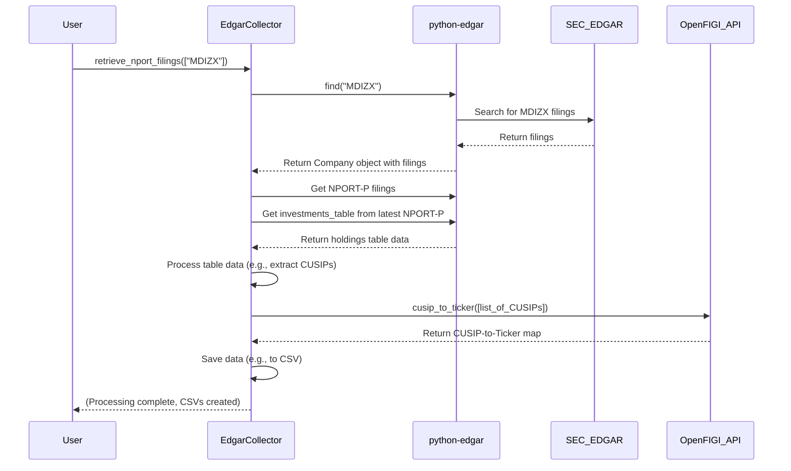

# Chapter 1: Data Collector (EdgarCollector)

Welcome to the FOFs-Capstone project! This project helps analyze "Funds of Funds" (FOFs) – mutual funds that primarily invest in other mutual funds. To do any analysis, we first need data! This chapter introduces our dedicated data gatherer: the `EdgarCollector`.

## The Problem: Where Does Fund Data Come From?

Imagine you want to know exactly what stocks or bonds your favorite mutual fund (like `MDIZX`) holds. You can't just guess! Companies, especially financial ones, have to report this information publicly. In the US, they file reports with the Securities and Exchange Commission (SEC).

Finding these specific reports, downloading them, and extracting the *exact* information we need (like the list of holdings) can be tricky. It's like needing specific government documents from a giant library – you need someone who knows exactly where to look and how to pull out the relevant pages.

This is where our `EdgarCollector` comes in.

## Meet the EdgarCollector: Your Financial Data Researcher

Think of the `EdgarCollector` as a specialized digital researcher. Its main job is to:

1.  **Go to the SEC's online database (called EDGAR).**
2.  **Find specific reports called "NPORT filings"** for the mutual funds we care about. These filings list a fund's holdings.
3.  **Download these filings.**
4.  **Extract the crucial table** inside the filing that lists all the investments (stocks, bonds, other funds).
5.  **Sometimes, perform an extra lookup:** NPORT filings often use a special identifier called a CUSIP. The `EdgarCollector` can use another service (OpenFIGI) to translate these CUSIPs into more familiar stock ticker symbols (like 'AAPL' for Apple).
6.  **Hand over the raw data** it collected, ready for the next step in our project.

It uses a helpful tool called the `python-edgar` library to talk to the SEC's EDGAR database, making the process much easier.

## Key Concepts Explained

*   **SEC EDGAR:** The Electronic Data Gathering, Analysis, and Retrieval system. It's the SEC's huge online database where companies file required reports. Think of it as a massive digital library for official financial documents.
*   **NPORT Filings:** A specific type of report that mutual funds file periodically (usually quarterly) listing their complete portfolio holdings. This is the gold mine of data for our project. We specifically look for `NPORT-P` (Periodic) filings.
*   **`python-edgar` library:** A Python package that makes it easier to programmatically search and retrieve filings from the EDGAR database. Our `EdgarCollector` uses this library so it doesn't have to deal with the raw complexity of the EDGAR website directly.
*   **CUSIP:** A unique 9-character identifier for North American securities (stocks, bonds, funds). Think of it like a serial number for a specific investment. You'll find these in NPORT filings.
*   **Ticker Symbol:** A short code (like 'AAPL', 'GOOG', 'MDIZX') used to identify publicly traded securities on stock exchanges. These are more commonly recognized than CUSIPs.
*   **OpenFIGI API:** An online service (API) that helps map various financial identifiers. We use it to convert CUSIPs found in the filings into Ticker symbols. It's like a translation dictionary for financial IDs.

## How to Use the EdgarCollector

Using the `EdgarCollector` is straightforward. You essentially tell it which fund tickers you're interested in, and it goes off to find the data.

```python
# Import the collector
from src.collectors.edgar_collector import EdgarCollector

# Create an instance of the collector
# This automatically reads necessary API keys (more on this later)
collector = EdgarCollector()

# Define the list of fund tickers you want data for
fund_tickers = ["MDIZX", "TSVPX"]

# Tell the collector to retrieve the NPORT filings
# This process can take some time!
print(f"Asking the collector to find data for: {fund_tickers}")
collector.retrieve_nport_filings(fund_tickers)

print("Collector has finished its work.")
# Expected Outcome: The collector will have downloaded NPORT filings,
# extracted holdings, and saved them into CSV files (e.g., MDIZX.csv, TSVPX.csv)
# in the project's root directory. It also prints debug messages.
```

In this example:
1.  We import the `EdgarCollector` class.
2.  We create an `EdgarCollector` object. When created, it automatically looks for credentials needed to talk to the SEC and OpenFIGI (we'll see how later).
3.  We define a list containing the ticker symbols of the funds we want to investigate.
4.  We call the `retrieve_nport_filings` method, passing our list of tickers.
5.  The collector then does its work: contacting EDGAR, finding NPORT-P filings, extracting holdings tables, and saving the results as `.csv` files (like `MDIZX.csv`).

## Under the Hood: How Does it Work?

Let's follow the `EdgarCollector` researcher on its journey:

1.  **Get Credentials:** When `EdgarCollector` starts, it needs "access passes". It reads your SEC User Agent (to identify yourself politely to EDGAR) and your OpenFIGI API key from a special configuration file (`.env`).
2.  **Receive Task:** You give it a list of fund tickers (e.g., `["MDIZX", "TSVPX"]`).
3.  **Process Each Ticker:** For each ticker (`MDIZX`, then `TSVPX`):
    *   **Search EDGAR:** It uses the `python-edgar` library to search the EDGAR database for the company associated with the ticker.
    *   **Filter Filings:** It asks for only `NPORT-P` filings for that company.
    *   **Get Latest Filing:** It usually takes the most recent `NPORT-P` filing.
    *   **Extract Holdings:** It digs into the filing object provided by `python-edgar` and pulls out the `investments_table`.
    *   **Save Raw Data:** It organizes this table data (using the `pandas` library) and saves it to a CSV file (e.g., `MDIZX.csv`).
4.  **(Optional) Translate CUSIPs:** If the holdings table contains a 'Cusip' column:
    *   **Collect CUSIPs:** It gathers all the CUSIPs from the table.
    *   **Call OpenFIGI:** It sends this list of CUSIPs to the OpenFIGI API.
    *   **Receive Tickers:** OpenFIGI sends back the corresponding Ticker symbols (if found).
    *   *(Note: The current `retrieve_nport_filings` uses these tickers to potentially fetch *more* NPORT filings if the holdings are themselves funds, but the core CUSIP-to-Ticker lookup happens in `cusip_to_ticker`)*.

Here's a simplified diagram showing the main interactions for fetching one fund's data:



## Diving Deeper into the Code

Let's peek at some key parts of the `src/collectors/edgar_collector.py` file.

**1. Initialization and Credentials:**

```python
# File: src/collectors/edgar_collector.py
import os
from dotenv import load_dotenv
from edgar import set_identity # From python-edgar library

class EdgarCollector:
    def __init__(self):
        load_dotenv() # Load variables from .env file
        self._initialize_credentials()
        # ... setup logger ...

    def _initialize_credentials(self) -> None:
        # Get SEC User Agent from .env file
        self.sec_identity = os.getenv('SEC_USER_AGENT')
        if not self.sec_identity:
            raise ValueError("SEC_USER_AGENT not found...")

        # Get OpenFIGI API key from .env file
        self.openfigi_api_key = os.getenv('OPENFIGI_API_KEY')
        if not self.openfigi_api_key:
            raise ValueError("OPENFIGI_API_KEY not found...")

        # Tell python-edgar library how to identify us to the SEC
        set_identity(self.sec_identity)
```

*   `load_dotenv()`: This function reads a file named `.env` in your project directory. This file should store sensitive information like your API keys, keeping them out of your main code.
*   `os.getenv(...)`: This fetches the value of an environment variable (like `SEC_USER_AGENT` or `OPENFIGI_API_KEY`) which was loaded from the `.env` file.
*   `set_identity(...)`: This is crucial. The SEC requires you to identify your script when accessing EDGAR programmatically. You need to provide a unique User-Agent string (like "Your Name Your Company contact@email.com").

**2. Fetching NPORT Filings:**

```python
# File: src/collectors/edgar_collector.py
from edgar import find # From python-edgar library
import pandas as pd

class EdgarCollector:
    # ... (init and other methods) ...

    def retrieve_nport_filings(self, tickers: List[str]) -> None:
        for ticker in tickers:
            try:
                # Use python-edgar to find the company/fund
                company = find(ticker)

                # Filter for NPORT-P filings only
                filings = company.filings.filter(form="NPORT-P")

                if len(filings) == 0:
                    # Skip if no NPORT filings found for this ticker
                    print(f"DEBUG: No NPORT-P filings found for {ticker}")
                    continue

                # Get the actual filing object (usually the latest)
                # and access its investments_table
                latest_filing = filings[0].obj()
                investments_table = latest_filing.investments_table
                print(f"DEBUG: Retrieved investments table for {ticker}")

                # ... (Code to process table into DataFrame and save to CSV) ...
                # (This part uses pandas to create a structured table)
                # df = pd.DataFrame(...)
                # df.to_csv(f"{ticker}.csv", index=False)

            except Exception as e:
                print(f"DEBUG ERROR: Error processing {ticker}: {str(e)}")
                continue # Move to the next ticker if an error occurs
```

*   `find(ticker)`: This is the magic from `python-edgar`. It searches EDGAR for the entity matching the ticker.
*   `company.filings.filter(form="NPORT-P")`: This narrows down the search results to only the NPORT-P filings we need.
*   `filings[0].obj()`: This gets the most recent filing from the filtered list and parses it into a usable object.
*   `investments_table`: This attribute directly gives us the holdings data we need from the parsed filing.
*   The rest of the code (omitted slightly for brevity) uses the `pandas` library to convert this raw table data into a DataFrame (like a spreadsheet in code) and saves it as a CSV file.

**3. Converting CUSIPs to Tickers:**

```python
# File: src/collectors/edgar_collector.py
import requests

class EdgarCollector:
    # ... (init and other methods) ...

    def cusip_to_ticker(self, cusip_list: List[str]) -> Dict[str, str]:
        url = "https://api.openfigi.com/v3/mapping" # OpenFIGI API endpoint
        headers = {
            "Content-Type": "application/json",
            "X-OPENFIGI-APIKEY": self.openfigi_api_key # Use our API key
        }
        # Prepare the request data: list of CUSIPs to look up
        payload = [{"idType": "ID_CUSIP", "idValue": cusip} for cusip in cusip_list]

        try:
            # Send the request to the OpenFIGI API
            response = requests.post(url, json=payload, headers=headers)
            if response.status_code == 200:
                data = response.json() # Get the results as JSON
                # ... (Code to process the response and build a CUSIP -> Ticker dictionary) ...
                results = {} # e.g., {'037833100': 'AAPL', ...}
                return results
            else:
                # Handle API errors
                return {cusip: "Not Found" for cusip in cusip_list}
        except Exception as e:
            # Handle connection errors etc.
            return {cusip: "Not Found" for cusip in cusip_list}
```

*   This method takes a list of CUSIP strings.
*   It defines the OpenFIGI API `url` and the necessary `headers`, including our API key.
*   It creates a `payload` in the specific JSON format required by OpenFIGI, listing each CUSIP we want to look up.
*   `requests.post(...)` sends this data to the OpenFIGI server.
*   If successful (`response.status_code == 200`), it parses the JSON response and creates a dictionary mapping the original CUSIPs to the found Tickers (or "Not Found").

## Connecting to the Rest of the Project

The `EdgarCollector` is just the first step. It gathers the raw ingredients (the holdings data). This raw data isn't stored permanently or structured nicely yet.

*   Scripts like the one in [Data Loading & Management Scripts](04_data_loading___management_scripts.md) will *use* the `EdgarCollector` to fetch the initial data.
*   This fetched data then needs to be organized and saved into our database. This involves defining how the data should look using [Database Models (SQLAlchemy)](02_database_models__sqlalchemy_.md) and using the [Database Manager](03_database_manager.md) to interact with the actual database.

## Conclusion

You've now met the `EdgarCollector`, our project's diligent data researcher! You learned:

*   Why we need it: To reliably fetch specific financial data (NPORT filings) from the SEC EDGAR database.
*   What it does: Finds filings, extracts holdings tables, and can translate CUSIPs to Tickers using OpenFIGI.
*   How it uses tools: Leverages the `python-edgar` library and `requests`.
*   How it fits in: It's the crucial first step in our data pipeline, providing the raw data for later processing and storage.

Now that we have a way to collect the raw data, how do we define the structure to store it permanently? That's where database models come in.

**Next Up:** Let's learn how to define the blueprints for our database tables in [Chapter 2: Database Models (SQLAlchemy)](02_database_models__sqlalchemy_.md).

---

Generated by [AI Codebase Knowledge Builder](https://github.com/The-Pocket/Tutorial-Codebase-Knowledge)