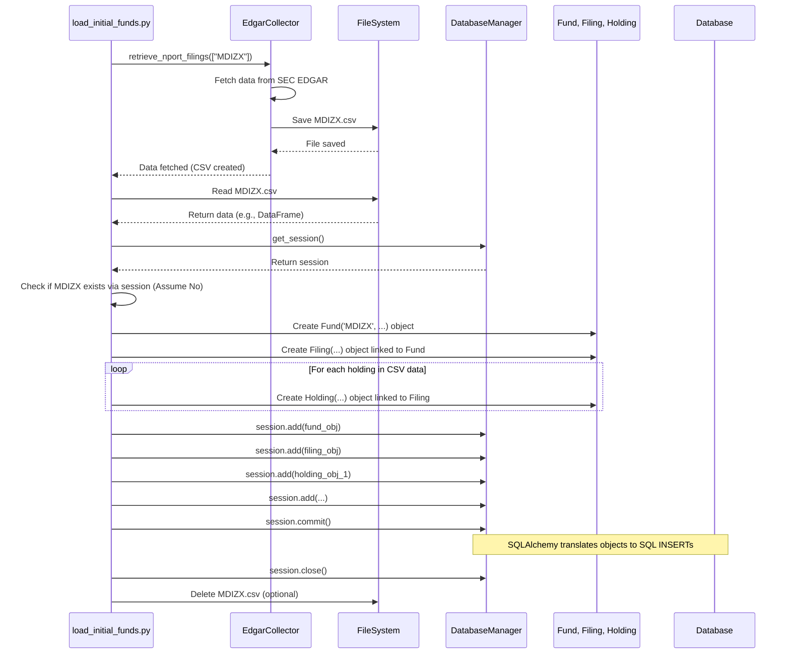

# Chapter 4: Data Loading & Management Scripts

Welcome back! In [Chapter 3: Database Manager](03_database_manager.md), we met the `DatabaseManager`, our project's "librarian" responsible for handling connections and sessions to talk to our database. We now have:

1.  A researcher to get raw data ([Data Collector (EdgarCollector)](01_data_collector__edgarcollector_.md)).
2.  Blueprints for how to store the data ([Database Models (SQLAlchemy)](02_database_models__sqlalchemy_.md)).
3.  A librarian to manage access to the database building ([Database Manager](03_database_manager.md)).

## The Problem: Putting It All Together for Routine Tasks

Imagine our library (database) is ready. We have the plans (models) and the librarian (manager). Now, we need the actual crew and procedures to perform essential tasks:

*   **Initial Setup:** How do we prepare a brand new, empty library building? (Reset the database).
*   **Stocking the Shelves:** How do we get the first batch of books (initial fund data) collected by our researcher (`EdgarCollector`) onto the shelves according to our plans (models), using the librarian's help (manager)?
*   **Finding Related Books:** If some books mention other specific books (funds holding other funds), how do we find and stock those too?
*   **Inventory Check:** How do we make sure the books are correctly placed and accounted for? (Verify data).
*   **Backup:** How do we make a copy of the library's catalog or all its contents? (Export schema/data).

Doing these manually would be slow and error-prone. We need automated procedures – scripts!

## Meet the Maintenance Crew: Our Utility Scripts

Think of the scripts in the `src/scripts/` directory and some helper scripts in the root folder (like `run_all.py`) as the **specialized tools and procedures used by the application's maintenance crew**.

Their job is to automate common, essential tasks related to setting up the database, loading data into it, ensuring the data is correct, and backing things up. They orchestrate the components we've already learned about.

**Key Types of Scripts:**

1.  **Database Setup (`reset_database.py`):** This script acts like a "demolition and rebuild" crew. It completely wipes the database clean (drops all tables) and then rebuilds the structure based on our [Database Models (SQLAlchemy)](02_database_models__sqlalchemy_.md). Useful for starting fresh.
2.  **Initial Data Loading (`load_initial_funds.py`):** This is the primary "stocking crew". It takes a list of fund tickers (like `["MDIZX", "TSVPX"]`), tells the [Data Collector (EdgarCollector)](01_data_collector__edgarcollector_.md) to fetch their latest NPORT filings (which often get saved as temporary CSV files), reads that data, creates corresponding `Fund`, `Filing`, and `Holding` objects (using the [Database Models (SQLAlchemy)](02_database_models__sqlalchemy_.md)), and uses the [Database Manager](03_database_manager.md) to save these objects into the database.
3.  **Underlying Data Loading (`load_underlying_holdings.py`):** This is a more specialized crew. It looks at the funds already loaded (e.g., MDIZX) and identifies if they hold *other* funds (based on CUSIPs/Tickers found in the holdings). It then uses the [Data Collector (EdgarCollector)](01_data_collector__edgarcollector_.md) again to fetch data for these *underlying* funds and adds them to the database, linking them correctly. This is crucial for analyzing Funds of Funds.
4.  **Data Verification (`verify_*.py`):** This is the "quality control" team. Scripts like `verify_holdings.py` or `verify_fund_structure.py` run queries against the database (using the [Database Manager](03_database_manager.md) and models) to check if the data looks correct – e.g., does MDIZX have holdings listed? Do the underlying funds seem to be loaded?
5.  **Export (`export_schema.py`, `export_database.py`):** This is the "archiving" team. They can generate a file containing the SQL commands to recreate the database structure (`schema.sql`) or a full backup including all the data (`database_backup.sql`).
6.  **Workflow Runners (`run_all.py`, `load_vhgex.py`, `update_fund_types.py`):** These are utility scripts that combine steps or perform specific updates. `run_all.py` is particularly useful as it can orchestrate resetting, loading initial funds, loading underlying funds, and even verification in the correct sequence.

## How to Use These Scripts

These scripts are typically designed to be run from your terminal in the project's main directory.

**Example 1: Resetting the Database**

```bash
python src/scripts/reset_database.py
```

*   **Input:** None (it uses database connection info from your settings/`.env` file).
*   **Output:** Messages in the terminal indicating that tables are being dropped and recreated. Your database will be empty but have the correct structure afterwards.

**Example 2: Loading Initial Funds (MDIZX, TSVPX, etc.)**

```bash
python src/scripts/load_initial_funds.py
```

*   **Input:** The script has a hardcoded list of initial tickers (like `["MDIZX", "TSVPX", ...]`). It also uses settings for the database and potentially API keys for the [Data Collector (EdgarCollector)](01_data_collector__edgarcollector_.md).
*   **Output:** Debug messages showing progress (fetching data, processing tickers). It will create temporary CSV files (like `MDIZX.csv`) and then load the data from them into the database. A summary of successful, updated, or failed tickers is printed at the end. The temporary CSVs are usually deleted afterwards.

**Example 3: Loading Underlying Holdings**

```bash
python src/scripts/load_underlying_holdings.py
```

*   **Input:** Reads the existing funds from the database (loaded by `load_initial_funds.py`). Uses the collector to find data for funds held by the initial funds.
*   **Output:** Debug messages about finding CUSIPs, mapping them to tickers, fetching data for underlying funds, and loading them into the database.

**Example 4: Running the Full Workflow (Recommended)**

The `run_all.py` script simplifies running the common sequence.

```bash
# Reset the database and load ALL data (initial + underlying)
python run_all.py --reset-db

# Load data WITHOUT resetting first (if DB already exists)
python run_all.py

# Reset, load, AND verify the data
python run_all.py --reset-db --verify
```

*   **Input:** Command-line flags (`--reset-db`, `--verify`). Uses settings.
*   **Output:** Messages indicating which step is running (Resetting DB, Loading initial, Loading underlying, Verifying).

## Under the Hood: How `load_initial_funds.py` Works

Let's trace the journey of the `load_initial_funds.py` script when it tries to load data for a fund like 'MDIZX'.

1.  **Initialization:** The script starts and creates instances of the necessary tools:
    *   `DatabaseManager()`: Gets ready to talk to the database.
    *   `EdgarCollector()`: Gets ready to fetch data from the SEC.
    *   Gets a database `session` from the manager.
2.  **Define Task:** The script identifies the list of tickers to process (e.g., `["MDIZX", "TSVPX", ...]`).
3.  **Fetch Data:** For each ticker ('MDIZX'):
    *   It calls `collector.retrieve_nport_filings(["MDIZX"])`.
    *   The collector goes to the SEC EDGAR database, finds the latest NPORT-P filing for MDIZX, extracts the holdings table, and saves it as `MDIZX.csv` in the project directory.
4.  **Process Data File:**
    *   The script looks for the `MDIZX.csv` file.
    *   It reads the data from the CSV file (using the `pandas` library).
5.  **Check Database:**
    *   It asks the `FundService` (which uses the database session) if a fund with ticker 'MDIZX' already exists.
6.  **Create/Update Database Records:**
    *   **If 'MDIZX' is new:**
        *   It creates a `Fund` object (`Fund(ticker='MDIZX', name='...', fund_type='fund_of_funds')`).
        *   It creates a `Filing` object linked to the new `Fund` object.
        *   It iterates through the rows in the CSV data, creating a `Holding` object for each row, linking it to the `Filing` object.
        *   It uses the database `session` (obtained from the `DatabaseManager`) to `add` all these new objects and then `commit` them to the database.
    *   **If 'MDIZX' exists:**
        *   It might update the existing `Fund` record (though the script focuses more on adding new filings/holdings).
        *   It *might* add a new `Filing` and associated `Holdings` if the data is newer than what's already stored (the provided script logic might simply update or skip, depending on implementation).
7.  **Cleanup:** After processing all tickers, the script might delete the temporary CSV files. It also closes the database session.

Here's a simplified diagram of the flow for loading one new fund:



## Diving Deeper into the Code (`src/scripts/load_initial_funds.py`)

Let's look at simplified snippets from `src/scripts/load_initial_funds.py` to see how it uses the components.

**1. Initialization:**

```python
# File: src/scripts/load_initial_funds.py (Simplified)
from src.collectors.edgar_collector import EdgarCollector
from src.database.manager import DatabaseManager
from src.services.fund_service import FundService # Used for DB interaction logic
import pandas as pd
import os

class DataLoader:
    def __init__(self):
        # Get the database manager (connects to DB)
        self.db = DatabaseManager()
        # Get a session to talk to the DB
        self.session = self.db.get_session()
        # Get the data collector
        self.collector = EdgarCollector()
        # ... setup logger ...

    # ... (rest of the class) ...
```

*   This sets up the necessary objects: `DatabaseManager`, `EdgarCollector`, and gets a database `session` ready for use.

**2. Fetching and Processing Loop:**

```python
# File: src/scripts/load_initial_funds.py (Simplified)
# (Inside DataLoader class)

    async def load_funds(self, tickers: List[str]) -> Dict:
        results = {"success": [], "updated": [], "failed": []}
        try:
            # --- Step 1: Use Collector ---
            print(f"DEBUG: Starting NPORT filings collection for: {tickers}")
            self.collector.retrieve_nport_filings(tickers) # Saves CSVs
            print(f"DEBUG: NPORT filings collection completed")

            for ticker in tickers:
                try:
                    # --- Step 2: Read Data File ---
                    csv_path = f"{ticker}.csv"
                    if not os.path.exists(csv_path):
                        print(f"DEBUG ERROR: CSV file not found for {ticker}")
                        results["failed"].append(ticker)
                        continue
                    df = pd.read_csv(csv_path) # Read data using pandas

                    # --- Step 3: Check Database & Create Objects ---
                    # (Simplified logic - uses FundService which handles model creation)
                    existing_fund = FundService.get_fund_by_ticker(self.session, ticker)

                    if existing_fund:
                        # Logic to update if needed (omitted for simplicity)
                        print(f"DEBUG: Fund {ticker} already exists. Updating...")
                        # Assume update happens via FundService.update_fund_holdings
                        results["updated"].append(ticker)
                    else:
                        print(f"DEBUG: Creating new fund {ticker}...")
                        # FundService handles creating Fund, Filing, Holding objects
                        # using the data in 'df' and saving via the session.
                        # Example of conceptual steps inside FundService:
                        # fund_obj = Fund(ticker=..., name=...)
                        # filing_obj = Filing(fund=fund_obj, ...)
                        # holding_objs = [Holding(filing=filing_obj, ...) for row in df]
                        # session.add_all([fund_obj, filing_obj] + holding_objs)
                        # session.commit()

                        # Simplified call to a service that does the work:
                        FundService.create_new_fund_with_holdings(self.session, ticker, df)
                        results["success"].append(ticker)

                    print(f"DEBUG: Successfully processed {ticker}")

                except Exception as e:
                    # Basic error handling
                    print(f"DEBUG ERROR: Error processing {ticker}: {str(e)}")
                    results["failed"].append(ticker)
                    self.session.rollback() # Important: undo changes on error
                    continue # Move to next ticker

            return results
        finally:
            # --- Step 4: Cleanup ---
            self.session.close() # Always close the session
            print(f"DEBUG: Closing database session")
            # Optionally delete CSV files
            # for ticker in tickers: os.remove(f"{ticker}.csv")

# --- How to run the script ---
# (Code at the bottom of the file)
# async def main():
#     tickers = ["MDIZX", "TSVPX", ...] # Define tickers
#     loader = DataLoader()
#     await loader.load_funds(tickers)
#     # Print summary
#
# if __name__ == "__main__":
#     asyncio.run(main())
```

*   This simplified code shows the main steps: call the collector, loop through tickers, read the corresponding CSV, check if the fund exists (using `FundService` which interacts with the database via the session), and then either update or create the fund and its related data (again, likely delegating the complex object creation and saving logic to the `FundService`).
*   Crucially, it uses a `try...except` block for each ticker and calls `session.rollback()` if an error occurs, preventing partial data from being saved.
*   It ensures the `session.close()` is called in the `finally` block, releasing the database connection.

These scripts act as the "glue" or the "workflow engine", coordinating the actions of the collector, models, and manager to achieve specific data management goals.

## Conclusion

You've now explored the Data Loading & Management Scripts, the essential "maintenance crew" for our project's database. You learned:

*   **Why they exist:** To automate database setup, data population, verification, and backup tasks.
*   **Key script types:** Resetting, initial loading, underlying loading, verification, and exporting.
*   **How they work:** By orchestrating the [Data Collector (EdgarCollector)](01_data_collector__edgarcollector_.md), [Database Models (SQLAlchemy)](02_database_models__sqlalchemy_.md), and [Database Manager](03_database_manager.md).
*   **How to run them:** Using simple Python commands from the terminal (often via `run_all.py`).

These scripts are vital for managing the lifecycle of the data in our application. They take the raw potential of our collector, models, and manager and turn it into concrete actions that build and maintain our fund analysis database.

Now that we have data loaded into our structured database, how do we create reusable functions to easily query and manipulate this data (like getting all holdings for a specific fund, or finding fund relationships) without writing raw database code every time? This is where the Fund Service comes in.

**Next Up:** Let's learn about the service layer that provides convenient methods for interacting with our fund data in [Chapter 5: Fund Service](05_fund_service.md).

---

Generated by [AI Codebase Knowledge Builder](https://github.com/The-Pocket/Tutorial-Codebase-Knowledge)