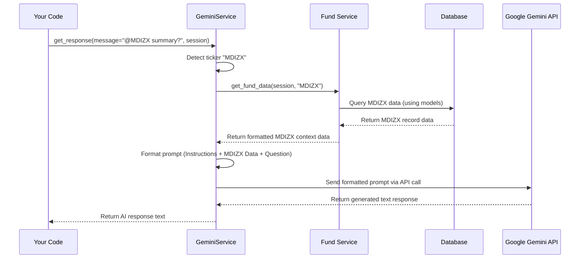

# Chapter 6: AI Service (GeminiService)

Welcome back! In [Chapter 5: Fund Service](05_fund_service.md), we created a convenient "helpdesk" (`FundService`) that lets other parts of our application easily ask for specific fund data (like holdings or asset allocation) without needing to know the database details.

Now, imagine you have all this great, structured data about funds. How can you interact with it naturally, like asking a question in plain English? What if you want to ask something complex, like "Compare the top holdings of MDIZX and TSVPX and tell me the key differences based on their data," and get a helpful, insightful answer?

## The Problem: Talking to Your Data Naturally

Just having data in a database isn't always the easiest way to explore it. Writing database queries or Python code to compare funds every time you have a question can be tedious. You might want to simply *ask* questions and get summaries or analyses.

Furthermore, you want the answers to be based *only* on the specific, up-to-date data you have painstakingly collected using the [Data Collector (EdgarCollector)](01_data_collector__edgarcollector_.md) and stored using our [Database Models (SQLAlchemy)](02_database_models__sqlalchemy_.md). You don't want generic answers from the internet; you want insights grounded in *your* project's data.

## Meet the AI Service (GeminiService): Your Smart Research Assistant

Think of the `GeminiService` as a **smart research assistant embedded right into our application**. It's like having a financial analyst who can:

1.  **Understand Your Questions:** It listens to your requests typed in natural English (like "Tell me about fund @MDIZX" or "Show the @overlap between MDIZX and TSVPX").
2.  **Identify Key Topics:** It spots important keywords, especially fund tickers (like `MDIZX`, `TSVPX`) or specific commands (like `@overlap`).
3.  **Gather Evidence:** It uses the [Fund Service](05_fund_service.md) (our data helpdesk) to look up the detailed, *current* information for the funds you mentioned from *our* database.
4.  **Consult the Expert Brain:** It takes your question and the specific evidence it gathered, formats them carefully into a "prompt," and sends it to a powerful AI brain – Google's Gemini **Large Language Model (LLM)**.
5.  **Deliver Grounded Insights:** It gets the answer back from Gemini and ensures the AI bases its response *only* on the evidence provided, not on general knowledge it might have learned elsewhere. This prevents hallucinations or outdated information.

It essentially acts as a bridge between your natural language questions, your project's specific data, and the powerful analytical capabilities of a modern AI.

## Key Concepts Explained

*   **Large Language Model (LLM):** An AI like Google's Gemini. It's trained on massive amounts of text and can understand, generate, and reason about human language incredibly well. Think of it as the powerful "brain" the service consults.
*   **API (Application Programming Interface):** A way for computer programs to talk to each other. The `GeminiService` uses Google's Gemini API to send questions (prompts) and receive answers over the internet. This requires an **API Key** (like a secret password, stored in our `.env` file) to authenticate.
*   **Context Retrieval:** The process of finding the relevant background information needed to answer a question. Our `GeminiService` does this by detecting tickers in your message and then asking the [Fund Service](05_fund_service.md) to retrieve data for those specific funds.
*   **Prompt Engineering:** Crafting the input (the "prompt") for the LLM is crucial. The `GeminiService` automatically builds a detailed prompt that includes:
    *   Clear instructions (e.g., "You are an AI assistant...", "Answer based ONLY on the data below...").
    *   The relevant fund data (the "context" or "evidence") fetched by the [Fund Service](05_fund_service.md).
    *   Your original question.
*   **Grounding:** This is super important! It means forcing the LLM to base its answer *strictly* on the provided context (our fund data). The `GeminiService` does this through careful prompt instructions, ensuring the AI acts like an analyst examining specific evidence, not just recalling general facts.

## How to Use the GeminiService

Using the `GeminiService` is quite simple from other parts of the application. You typically need a database session (to allow the service to fetch fund data) and then you call a method to get a response.

```python
# File: (Example usage, e.g., in a chatbot interface)
from src.services.gemini_service import GeminiService
from src.database.manager import DatabaseManager # To get a session

# --- Setup (usually happens elsewhere) ---
# Create a database manager instance
db_manager = DatabaseManager()
# Get a session to allow data lookup
session = db_manager.get_session()
# -----------------------------------------

# Create an instance of the AI service
# It automatically looks for the GEMINI_API_KEY in your .env file
ai_service = GeminiService()

# The user's question
user_message = "Can you summarize the main investments for @MDIZX?"

try:
    print(f"Asking the AI about: '{user_message}'")
    # Ask the service to get a response for the message,
    # providing the session so it can look up MDIZX data.
    ai_response = ai_service.get_response_for_single_message(
        message=user_message,
        session=session
    )

    print("\n--- AI Assistant Response ---")
    print(ai_response)
    # Expected Output: A text summary generated by Gemini,
    # specifically mentioning holdings, asset types, etc., based on the
    # MDIZX data fetched from *our* database via the FundService.
    # It should NOT give generic info about MDIZX found online.

except Exception as e:
    print(f"An error occurred: {e}")
finally:
    # Always close the session when finished
    session.close()
    print("\nDatabase session closed.")

```

In this example:
1.  We set up the `DatabaseManager` and get a `session` (as learned in [Chapter 3](03_database_manager.md)).
2.  We create an instance of `GeminiService`. It reads the necessary `GEMINI_API_KEY` from your environment settings (see [Chapter 8: Application Configuration (Settings)](08_application_configuration__settings_.md)).
3.  We define the user's question, including the ticker `@MDIZX`.
4.  We call `ai_service.get_response_for_single_message()`, passing the message and the database `session`.
5.  The service does its magic (detects ticker, fetches data, prompts Gemini).
6.  It prints the AI's response, which should be tailored to the data found in *our* database for MDIZX.
7.  We close the database session.

## Under the Hood: How Does it Answer?

Let's trace the steps when you ask `GeminiService` about "@MDIZX":

1.  **Receive Request:** The `get_response...` method gets your message ("... @MDIZX ...") and the database session.
2.  **Detect Ticker:** The service scans the message using pattern matching (regular expressions) and finds "@MDIZX". It extracts the ticker "MDIZX".
3.  **Fetch Context:** It uses the provided database `session` to call the [Fund Service](05_fund_service.md)'s `get_fund_data` method (or similar) for the ticker "MDIZX".
4.  **Fund Service Works:** The [Fund Service](05_fund_service.md) queries the database (using [Database Models (SQLAlchemy)](02_database_models__sqlalchemy_.md)) and retrieves the fund's name, holdings, asset allocation, etc.
5.  **Receive Context:** The `GeminiService` gets the MDIZX data back from the [Fund Service](05_fund_service.md).
6.  **(Optional) Fetch New Data:** If the ticker was detected but *not* found in the database, the `GeminiService` has logic (`fetch_and_store_new_tickers`) to try and use the [Data Collector (EdgarCollector)](01_data_collector__edgarcollector_.md) and data loading helpers ([Chapter 4](04_data_loading___management_scripts.md)) to fetch and save the data first, then proceed.
7.  **Format Prompt:** The service constructs a detailed prompt for the Gemini AI. It looks something like this (simplified):
    ```
    SYSTEM: You are a helpful Fund of Funds AI assistant. Analyze the data provided below. Base your answer ONLY on this data. Do not use outside knowledge.

    REFERENCE DATA - FUND INFORMATION:
    ===== FUND ANALYSIS: MDIZX =====
    📈 **MDIZX** (Meridian Small Cap Growth Fund)
    **FUND SUMMARY:**
    - Fund Type: underlying_fund
    - Filing Date: 2023-12-31
    **ASSET ALLOCATION:**
    - Equity: 95.00%
    - Cash: 5.00%
    **TOP HOLDINGS (Top 10):**
    1. Holding XYZ (XYZ): 5.50% ($...)
    2. Investment ABC (ABC): 4.20% ($...)
    ... (more holdings data) ...

    ===== USER QUESTION =====
    Can you summarize the main investments for @MDIZX?

    ===== CRITICAL INSTRUCTION =====
    Analyze the reference data EXCLUSIVELY. Summarize MDIZX's main investments based ONLY on the holdings listed above.
    ```
8.  **Call Gemini API:** It sends this carefully crafted prompt over the internet to Google's Gemini API endpoint, including the secret API key for authorization.
9.  **Gemini Responds:** The Gemini LLM processes the prompt, focusing heavily on the "REFERENCE DATA" and the "CRITICAL INSTRUCTION," and generates a text answer based *only* on that MDIZX data.
10. **Return Response:** The `GeminiService` receives the text response from the API and returns it to your code.

Here’s a simplified diagram of the flow:



## Diving Deeper into the Code (`src/services/gemini_service.py`)

Let's peek at some key parts of the `src/services/gemini_service.py` file.

**1. Initialization:**

```python
# File: src/services/gemini_service.py (Simplified)
import os
from dotenv import load_dotenv
from src.utils.logger import setup_logger

class GeminiService:
    def __init__(self):
        """Initialize the Gemini service."""
        self.logger = setup_logger('gemini_service')
        load_dotenv() # Load .env file for secrets
        self.api_key = os.getenv('GEMINI_API_KEY') # Get the key
        if not self.api_key:
            self.logger.warning("GEMINI_API_KEY not found!")
        # Define the URL for the Gemini API
        self.api_url = "https://generativelanguage.googleapis.com/v1beta/models/gemini-2.0-flash:generateContent"
```

*   When you create `GeminiService()`, it immediately loads environment variables using `load_dotenv()`.
*   It fetches the crucial `GEMINI_API_KEY` needed to talk to Google's service. You must have this key defined in your `.env` file (see [Chapter 8](08_application_configuration__settings_.md)).
*   It stores the API endpoint URL.

**2. Detecting Tickers:**

```python
# File: src/services/gemini_service.py (Simplified)
import re
from typing import Set

class GeminiService:
    # ... (init) ...
    def detect_tickers(self, text: str) -> Set[str]:
        """Detects potential fund tickers (like @ABCDE or FGHIJ) in text."""
        # Pattern for @TICKER mentions
        mention_pattern = r'@([A-Z]{1,5}(?:\.[A-Z]{1,2})?)\b'
        # Pattern for general uppercase tickers (1-5 letters)
        ticker_pattern = r'\b[A-Z]{1,5}(?:\.[A-Z]{1,2})?\b'

        explicit_mentions = set(re.findall(mention_pattern, text))
        # Prioritize explicit @mentions if found
        if explicit_mentions:
            self.logger.info(f"Detected explicit mentions: {explicit_mentions}")
            return explicit_mentions

        potential_tickers = set(re.findall(ticker_pattern, text))
        # Filter out common English words mistaken for tickers
        common_words = {'I', 'A', 'AN', 'THE', 'AND', 'OR', 'BUT', 'IF'}
        filtered_tickers = potential_tickers - common_words
        self.logger.info(f"Detected potential tickers: {filtered_tickers}")
        return filtered_tickers
```

*   This method uses **regular expressions (`re`)** – a way to define text patterns.
*   It looks for patterns like `@` followed by 1-5 uppercase letters (`mention_pattern`) or just standalone 1-5 uppercase letter words (`ticker_pattern`).
*   It includes basic filtering to avoid matching common words like "A" or "I".

**3. Enhancing the Message with Fund Data:**

```python
# File: src/services/gemini_service.py (Simplified)
from typing import Tuple, Set
from src.services.fund_service import FundService # Needs FundService

class GeminiService:
    # ... (init, detect_tickers) ...
    def enhance_message_with_fund_data(self, session, message: str, ...) -> Tuple[str, bool, Set[str]]:
        """Looks for tickers, fetches data, and builds the enhanced prompt."""
        potential_tickers = self.detect_tickers(message)
        # ... (Code to check which tickers are valid in our DB) ...
        # ... (Code to call self.fetch_and_store_new_tickers if needed) ...
        valid_tickers = potential_tickers # Simplified assumption

        fund_data_sections = []
        if valid_tickers:
            self.logger.info(f"Fetching data for: {valid_tickers}")
            for ticker in valid_tickers:
                # Use FundService to get data (requires session)
                fund_data = FundService.get_fund_data(session, ticker)
                if fund_data:
                    # Format the data into a nice string for the prompt
                    formatted_data = self.format_fund_data_for_prompt(fund_data)
                    fund_data_sections.append(formatted_data)

        if not fund_data_sections:
            return message, False, set() # No enhancement needed

        # Construct the final prompt string with instructions, data, and question
        prompt_parts = [
            "SYSTEM INSTRUCTION: Base your answer ONLY on the data provided below.",
            "===== REFERENCE DATA =====",
            "\n\n".join(fund_data_sections), # Insert the fetched data
            "===== USER QUESTION =====",
            message, # Original user message
            "===== CRITICAL INSTRUCTION: Analyze the REFERENCE DATA..."
        ]
        enhanced_prompt = "\n".join(prompt_parts)
        return enhanced_prompt, True, valid_tickers # Return enhanced prompt & status
```

*   This is a key orchestrator method. It calls `detect_tickers`.
*   It interacts with the [Fund Service](05_fund_service.md) (`FundService.get_fund_data`) to fetch the context for valid tickers found in our database.
*   It calls another helper (`format_fund_data_for_prompt`) to turn the raw fund data into a readable text block.
*   Crucially, it assembles the `enhanced_prompt` string by combining the system instructions, the fetched data ("REFERENCE DATA"), the original user question, and the final critical instructions.

**4. Getting the Response from the API:**

```python
# File: src/services/gemini_service.py (Simplified)
import requests # Needs requests library: pip install requests
import json
from typing import List, Dict

class GeminiService:
    # ... (init, enhance_message_with_fund_data) ...
    def get_response(self, messages: List[Dict[str, str]], session=None, ...) -> str:
        """Sends prompt to Gemini API and returns the response text."""
        if not self.api_key:
            return "Error: Gemini API key not configured."

        # --- Enhance the last message if needed ---
        last_message_content = messages[-1]['content']
        enhanced_prompt, was_enhanced, _ = self.enhance_message_with_fund_data(
            session, last_message_content, ...
        )
        # Use the enhanced prompt if enhancement happened
        prompt_to_send = enhanced_prompt if was_enhanced else last_message_content

        # --- Prepare API Request ---
        # Structure the request payload according to Gemini API requirements
        # (Simplified - actual payload structure is more complex for conversations)
        payload = {
            "contents": [{"role": "user", "parts": [{"text": prompt_to_send}]}]
        }
        headers = {"Content-Type": "application/json"}
        api_call_url = f"{self.api_url}?key={self.api_key}"

        # --- Make API Call and Handle Response ---
        try:
            response = requests.post(api_call_url, headers=headers, data=json.dumps(payload))
            response.raise_for_status() # Check for HTTP errors (like 401 Unauthorized)

            response_json = response.json()
            # Extract the text response (path might vary slightly based on API version)
            return response_json["candidates"][0]["content"]["parts"][0]["text"]

        except requests.exceptions.RequestException as e:
            self.logger.error(f"API Request failed: {e}")
            return f"Sorry, network error communicating with AI: {e}"
        except Exception as e:
            self.logger.exception(f"Error processing Gemini response: {e}")
            # Catch other potential errors (e.g., malformed JSON)
            return f"Sorry, an unexpected error occurred: {e}"

```

*   This method takes the conversation history (`messages`).
*   It calls `enhance_message_with_fund_data` to potentially enrich the *last* user message with context.
*   It constructs the JSON `payload` required by the Gemini API, including the final prompt content.
*   It uses the `requests` library to send a POST request to the `api_call_url`, including the headers and the JSON payload.
*   It checks the response status and parses the returned JSON to extract the AI-generated text.
*   It includes error handling for network issues or unexpected API responses.

## Conclusion

You've now met the `GeminiService`, our project's intelligent research assistant! You learned:

*   **Why it's useful:** It allows natural language interaction with our specific fund data, providing grounded, AI-driven insights.
*   **How it works:** It detects user intent (tickers, keywords), fetches relevant evidence using the [Fund Service](05_fund_service.md), engineers a detailed prompt for the Google Gemini LLM, and gets a response based *only* on that evidence.
*   **Key Concepts:** LLMs, APIs, Prompt Engineering, Context Retrieval, and crucial **Grounding**.
*   **How to use it:** Create an instance, provide a database session, and call `get_response` or `get_response_for_single_message`.

This service adds a powerful layer of intelligent analysis on top of our collected and structured data.

Our project now has data collection, database storage, data loading, a service layer for access, and even an AI layer. But what happens when we need to change our database structure *after* we've already created it and loaded data? How do we manage updates to our database blueprints ([Database Models (SQLAlchemy)](02_database_models__sqlalchemy_.md)) safely?

**Next Up:** Let's learn how to handle changes to our database schema over time using a tool called Alembic in [Chapter 7: Database Migrations (Alembic)](07_database_migrations__alembic_.md).

---

Generated by [AI Codebase Knowledge Builder](https://github.com/The-Pocket/Tutorial-Codebase-Knowledge)