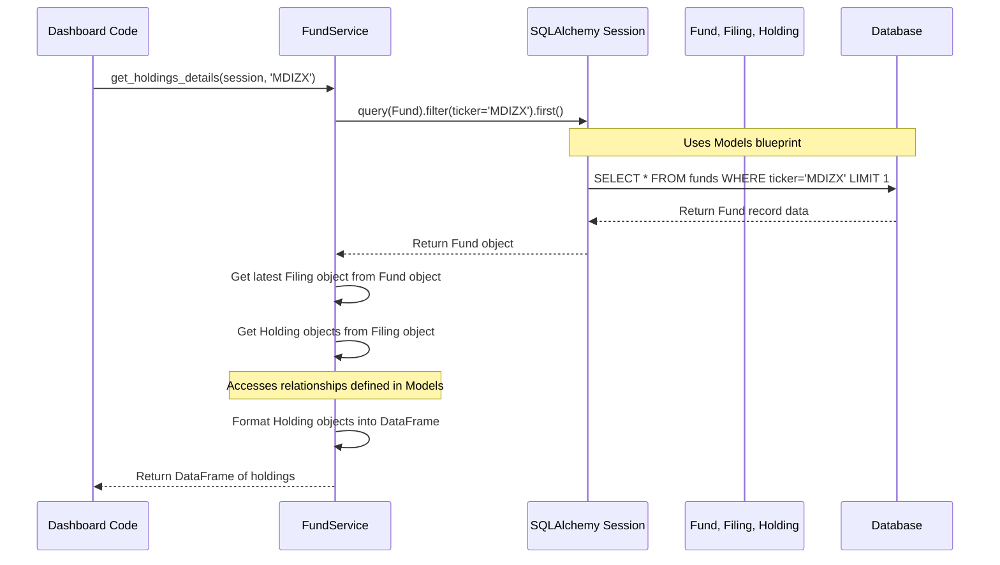

# Chapter 5: Fund Service

Welcome back! In [Chapter 4: Data Loading & Management Scripts](04_data_loading___management_scripts.md), we saw how specialized scripts act like a maintenance crew, using our collector, models, and manager to load and manage data in the database. Our database is now getting populated with valuable fund information!

## The Problem: Asking for Information Easily

Imagine our library (database) is neatly organized with books (funds), filing cards (filings), and lists of contents (holdings), all thanks to our blueprints ([Database Models (SQLAlchemy)](02_database_models__sqlalchemy_.md)) and librarian ([Database Manager](03_database_manager.md)).

Now, other parts of our project, like a web dashboard showing fund details or an AI assistant analyzing funds, need to *get* specific information. For example:

*   "Show me the exact investments (holdings) for the MDIZX fund from its most recent filing."
*   "Find the fund with the ticker 'TSVPX'."
*   "Give me a list of all the funds we have information about."

These other parts shouldn't need to know the complex details of how the database is structured or how to write database queries using SQLAlchemy. They just want to ask a simple question and get a clear answer. It's like calling a company's helpdesk – you state your need, and they figure out how to get you the information without explaining their internal procedures.

## Meet the Fund Service: Your Knowledgeable Fund Analyst Helpdesk

Think of the `FundService` as your project's dedicated **fund analyst helpdesk**. It sits between the parts of the application that *need* fund data (like the dashboard or AI) and the underlying database components (the [Database Manager](03_database_manager.md) and [Database Models (SQLAlchemy)](02_database_models__sqlalchemy_.md)).

Its main job is to:

1.  **Provide a Clean Menu (API):** It offers a simple list of functions (an Application Programming Interface or API) for common fund-related requests, like `get_fund_by_ticker(...)` or `get_holdings_details(...)`.
2.  **Understand Requests:** It takes simple inputs (like a fund ticker).
3.  **Handle the Details:** It uses the [Database Manager](03_database_manager.md) to get a database session and interacts with the [Database Models (SQLAlchemy)](02_database_models__sqlalchemy_.md) to perform the necessary database queries (finding funds, filings, holdings).
4.  **Apply Business Logic:** It contains the specific steps or rules for getting the data right (e.g., ensuring it retrieves holdings from the *latest* filing, calculating percentages, determining if a fund is a 'fund_of_funds').
5.  **Format the Answer:** It takes the raw data from the database and formats it into a clean, easy-to-use structure (like a list of dictionaries or a pandas DataFrame) before returning it.
6.  **Hide Complexity (Encapsulation):** It hides all the database interaction details from the parts of the application that are just asking for information.

Essentially, the `FundService` acts as a knowledgeable intermediary, making it easy and safe for other components to work with fund data.

## Key Concepts Explained

*   **Service Layer:** A common concept in software design. It's a layer of code dedicated to handling specific business tasks or logic. Our `FundService` is part of the service layer focused on fund operations.
*   **API (Application Programming Interface):** Think of this as a menu of functions or commands that a piece of software offers for others to use. The `FundService` provides an API with functions like `get_fund_by_ticker`, `get_holdings_details`, etc.
*   **Encapsulation:** This means bundling the data (accessed via models) and the methods that operate on that data (the service functions) together, and hiding the internal complexity. Callers only need to know *what* the service function does, not *how* it does it internally.
*   **Business Logic:** These are the rules specific to our application's domain (fund analysis). For example, deciding that "latest filing" means the one with the most recent `period_end_date`, or defining how to calculate if a fund is primarily holding other funds ('fund_of_funds'). This logic lives inside the `FundService`.

## How to Use the Fund Service

Using the `FundService` is designed to be straightforward. Other parts of the application (like a dashboard component or an AI agent) will typically already have a database session (obtained from the [Database Manager](03_database_manager.md)) and will use the `FundService`'s static methods.

**Example: Getting Holdings for 'MDIZX'**

Let's say a part of our dashboard needs to display the holdings for the MDIZX fund.

```python
# File: (Example usage, e.g., in src/dashboard/...)
from src.services.fund_service import FundService
from src.database.manager import DatabaseManager
import pandas as pd

# Assume we have a database manager instance
db_manager = DatabaseManager()
# Get a session to talk to the database
session = db_manager.get_session()

fund_ticker_to_show = "MDIZX"

try:
    print(f"Asking Fund Service for holdings of {fund_ticker_to_show}...")
    # Call the FundService method, passing the session and ticker
    holdings_df = FundService.get_holdings_details(session, fund_ticker_to_show)

    if not holdings_df.empty:
        print(f"Received holdings data for {fund_ticker_to_show}:")
        # Display the first 5 rows of the DataFrame
        print(holdings_df.head())
        # Expected Output (example):
        # Received holdings data for MDIZX:
        #                              Name Ticker      Cusip          Value   Pct    Category
        # 0                 Some Holding Co   SHC   123456789    $100,000.00  5.00      Equity
        # 1            Another Investment A   AIA   987654321     $50,000.00  2.50        Bond
        # ... (more rows)
    else:
        print(f"Fund Service reported no holdings found for {fund_ticker_to_show}.")

except Exception as e:
    print(f"An error occurred: {e}")
finally:
    # IMPORTANT: Always close the session when done
    session.close()
    print("Database session closed.")
```

In this example:
1.  We import `FundService` and `DatabaseManager`.
2.  We get a `session` from the `DatabaseManager` (as seen in [Chapter 3](03_database_manager.md)).
3.  We call the static method `FundService.get_holdings_details()`, providing the active `session` and the desired `ticker`.
4.  The `FundService` handles all the database interaction.
5.  It returns the results neatly formatted as a pandas DataFrame (`holdings_df`).
6.  Our dashboard code can then directly use this DataFrame.
7.  We make sure to close the session afterwards.

## Under the Hood: How `get_holdings_details` Works

What happens inside the `FundService` when you ask for 'MDIZX' holdings?

1.  **Receive Request:** The `get_holdings_details(session, 'MDIZX')` method is called.
2.  **Find the Fund:** It uses the provided `session` and the `Fund` model ([Chapter 2](02_database_models__sqlalchemy_.md)) to query the database: "Find the `Fund` record where the `ticker` is 'MDIZX'." (e.g., `session.query(Fund).filter(Fund.ticker == 'MDIZX').first()`).
3.  **Check for Fund/Filings:** If the fund isn't found or has no associated filings, it returns an empty result.
4.  **Get Latest Filing:** It accesses the fund's associated `filings` (using the relationship defined in the models). It typically assumes these are ordered (e.g., by date) and picks the most recent one (e.g., `fund.filings[0]`).
5.  **Get Holdings:** It accesses the chosen filing's associated `holdings` (again, using the model relationship, e.g., `latest_filing.holdings`). This retrieves all the `Holding` records linked to that specific filing from the database.
6.  **Format Data:** It iterates through the list of `Holding` objects received from the database. For each `Holding` object, it extracts the relevant attributes (`name`, `ticker`, `value`, `percentage`, `asset_type`, etc.).
7.  **Create DataFrame:** It organizes this extracted data into a structured format, like a pandas DataFrame, making sure columns have user-friendly names ('Name', 'Ticker', 'Value', 'Pct', 'Category').
8.  **Return Result:** It returns the formatted DataFrame to the code that originally called the service method.

Here’s a simplified sequence diagram:



## Diving Deeper into the Code (`src/services/fund_service.py`)

Let's peek at some key methods within `src/services/fund_service.py`, simplified for clarity.

**1. Getting a Fund by Ticker:**

```python
# File: src/services/fund_service.py (Simplified)
from sqlalchemy.orm import Session
from src.models.database import Fund, Filing, Holding
from typing import Optional

class FundService:
    # ... other methods ...

    @staticmethod
    def get_fund_by_ticker(session: Session, ticker: str) -> Optional[Fund]:
        """Gets a single Fund object from the DB by its ticker."""
        # Use the provided session to query the Fund model (table)
        # Filter where the 'ticker' column matches the input ticker
        # '.first()' gets only one result or None if not found
        fund = session.query(Fund).filter(Fund.ticker == ticker).first()
        return fund
```

*   This is a static method, meaning you call it directly on the class (`FundService.get_fund_by_ticker(...)`).
*   It takes the database `session` and the `ticker` string as input.
*   It uses the `session.query()` method from SQLAlchemy, specifying the `Fund` model as the target.
*   `.filter(Fund.ticker == ticker)` adds the condition to find the right row.
*   `.first()` executes the query and returns the first matching `Fund` object, or `None`.

**2. Getting Holdings Details:**

```python
# File: src/services/fund_service.py (Simplified)
import pandas as pd
from typing import List

class FundService:
    # ... other methods ...

    @staticmethod
    def get_holdings_details(session: Session, ticker: str) -> pd.DataFrame:
        """Get holdings details for a fund, formatted as a DataFrame."""
        # Step 1: Find the fund using the method above
        fund = FundService.get_fund_by_ticker(session, ticker)

        # Step 2: Check if fund and filings exist
        if not fund or not fund.filings:
            print(f"DEBUG: No fund or filings found for {ticker}")
            return pd.DataFrame() # Return empty DataFrame

        # Step 3: Get the latest filing (assuming sorted)
        latest_filing = fund.filings[0]

        # Step 4: Get the holdings associated with that filing
        holdings_list = latest_filing.holdings

        # Step 5: Format the data
        holdings_data = []
        for holding in holdings_list:
            # Extract data from each Holding object
            holdings_data.append({
                'Name': holding.name,
                'Ticker': holding.ticker,
                'Cusip': holding.cusip,
                # Format value nicely (example)
                'Value': f"${holding.value:,.2f}" if holding.value else "$0.00",
                'Pct': holding.percentage if holding.percentage else 0.0,
                'Category': holding.asset_type
            })

        # Step 6: Create and return a pandas DataFrame
        return pd.DataFrame(holdings_data)
```

*   This method orchestrates the steps outlined previously.
*   It reuses `get_fund_by_ticker` to find the `Fund` object.
*   It accesses the `fund.filings` and `latest_filing.holdings` attributes – these work because of the `relationship` definitions in our [Database Models (SQLAlchemy)](02_database_models__sqlalchemy_.md). SQLAlchemy automatically performs the necessary database lookups behind the scenes when you access these.
*   It loops through the `Holding` objects and builds a list of dictionaries (`holdings_data`), formatting the values as needed.
*   Finally, it converts this list of dictionaries into a pandas `DataFrame` for easy use by the caller.

The `FundService` contains many other helpful methods (`create_fund`, `create_filing`, `create_holdings`, `get_sankey_data`, etc.) that similarly encapsulate the logic for interacting with our fund data via the database models and manager.

## Conclusion

You've now learned about the `FundService`, our project's helpful fund analyst helpdesk!

*   **Why it's needed:** To provide a simple, clean way for other parts of the application to access and manipulate fund data without needing to know database specifics.
*   **What it does:** Offers an API (a set of functions) that takes simple requests, performs the necessary database operations using the [Database Manager](03_database_manager.md) and [Database Models (SQLAlchemy)](02_database_models__sqlalchemy_.md), applies business logic, and returns well-formatted results.
*   **Key Benefits:** Encapsulates complexity, centralizes fund-related logic, makes code cleaner and easier to maintain.

The `FundService` is a crucial layer that makes working with our carefully structured and loaded data much more convenient and robust. With easy access to detailed fund holdings and structures, what kind of advanced analysis can we perform?

**Next Up:** Let's explore how we can leverage this data with artificial intelligence using the [Chapter 6: AI Service (GeminiService)](06_ai_service__geminiservice_.md).

---

Generated by [AI Codebase Knowledge Builder](https://github.com/The-Pocket/Tutorial-Codebase-Knowledge)